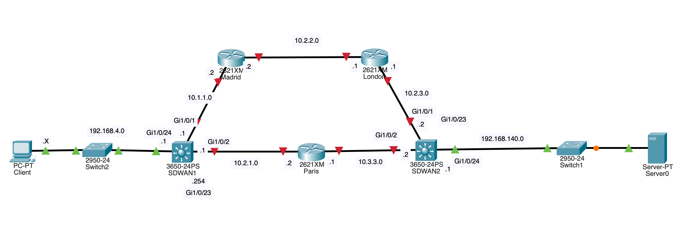
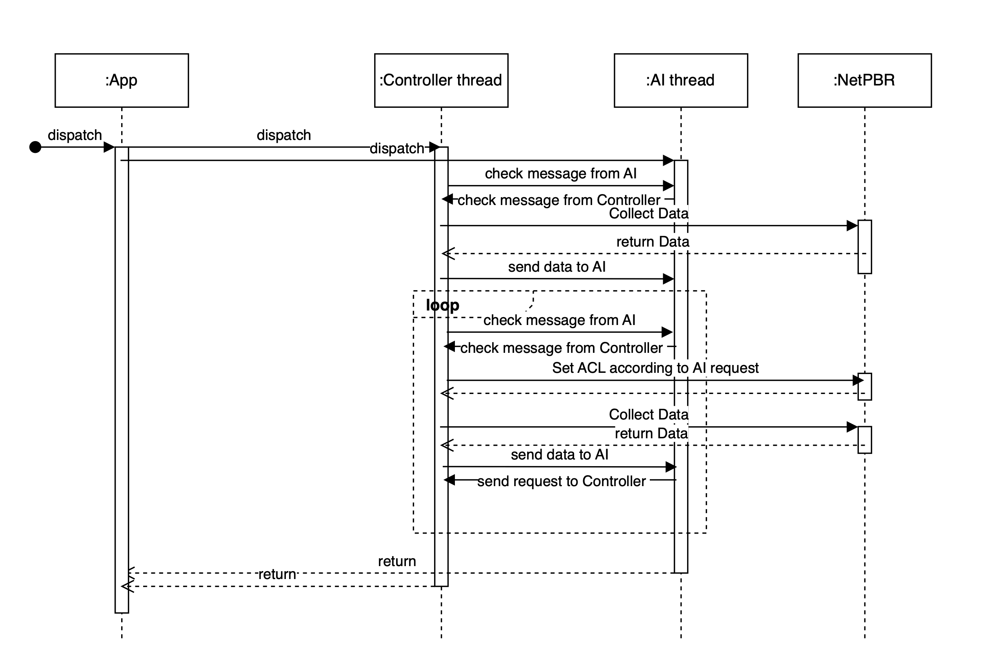
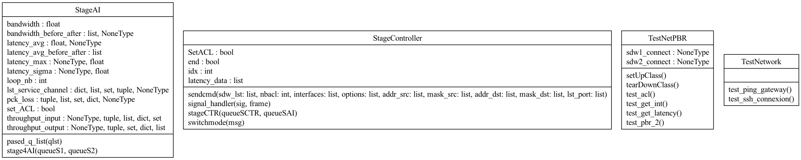
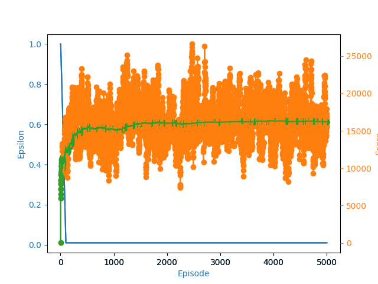

# NetPBR

## For User
### Install dependancies
- You have to compile abing (https://github.com/RichardWithnell/abing) and move binaries to /src/libs
```sh
python3.11 -m pip install -r requirement.txt
```

### Use
- Launch NetPBR Application with the following command :

```sh
python3.11 src/App.py
```

## For Developer



Warning : All theses IP are private IP so you need to set IP in setting of the application according to your network

### Code Analysis

    pyflakes src/*.py
    pylint --disable=C0200,C0301,C0325 src/*.py


### Diagram




### AI Input

- throughput (bit/s, from Cisco switch)
- pck_loss (%, from Cisco switch)
- latency_avg (from abing)
- latency_sigma (from abing)
- latency_max (from abing)
- Available_Bandwidth : bandwidth (from abing)

## In Development
TODO :
 - [ ] test PBR
 - [ ] fetch list of services use by interface (??)
 - [ ] Waiting function between AI and Controller

## SD-WAN Reinforcement Learning Project

### Code Structures
This project implements a reinforcement learning approach to optimize network routing decisions in a Software-Defined Wide Area Network (SD-WAN) environment. It uses the Deep Q-Network (DQN) algorithm to train an agent to make routing decisions based on network conditions.
The project consists of three main components:
1.	**src/GenererStat.py**: This module generates random network statistics (latency, bandwidth) with occasional perturbations. It provides a class ValeursStatistiques that generates and updates the network statistics values and puts them in a queue for access by other processes.
2.	**src/SDWANEnv.py**: This file contains a custom Gym environment for simulating an SDWAN (Software-Defined Wide Area Network) environment. The Gym environment is used to create a learning environment compatible with the OpenAI Gym library. It simulates network states such as the current bandwidth, latency, the flow type. The two available actions are using the MPLS link or the internet. To minimize the usage of the MPLS link, a penalty is added to each usage in the environment's reward function. The Gym environment generate random statistics in the initialization. The changes in the states will depend on the flow type and the action. the gym environnement allow the developer to define the reward function. In our case the reward function will take in consideration the flow type and also the link used
3. **src/DQN.py**: This file contains the `DeepQNetwork` class, which represents the neural network used to estimate the Q-function. The neural network is built using linear layers and utilizes the PyTorch library. It takes network states as input and produces Q-value estimations for each possible action and the `Agent` class, representing the learning agent that utilizes the neural network to make decisions and learn from experience. The agent employs the DQN algorithm with transition memories, an exploration/exploitation policy, and updates the network weights through reinforcement learning.


## Getting Started


To run the project, follow these steps:
1.	Install the required dependencies. The project requires Python 3.x and the following packages: gym, numpy, matplotlib and torch.
2.	Import the required modules and classes into your project.
3.	Generate network statistics using GenererStat.py. Adjust the values and perturbations in the ValeursStatistiques class to match your specific requirements. Make sure to update the values in the SDWANEnv class if needed.
4.	Instantiate the SDWANEnv environment and the Agent in your main script.
5.	Run the training loop by calling the appropriate methods from the Agent and SDWANEnv instances. Customize the loop based on your desired training settings and stopping criteria.
6.	Monitor the training progress by observing the printed output and, if desired, plot the learning curves using the provided plotLearning function.
Additional Notes
•	The project assumes a single flow with port 443 (service_HTTP). You can modify the code to handle multiple flows or different port configurations as per your requirements.
•	The network statistics generation in GenererStat.py is currently randomly generated. Adjust the ranges and distributions to match your network's characteristics for a more realistic simulation.
•	The code provided is a starting point and can be customized and extended to suit your specific use case and requirements.
•	Ensure that you have a good understanding of reinforcement learning, DQN, and the OpenAI Gym framework to make the most of this project.


### Result





Blue : epsilon value in every episode (exploration frequency/exploitation frequency)

Oranges: scores in every episode (rewards)

Green: Avg score in every episode

#### Comment

- The epsilon decrease to favorize the exploitation
- The avg reward increase and converge. that shows that our RL is improving our statistics


